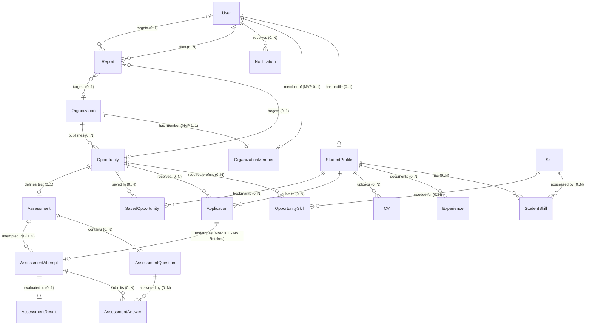

# Campus Opportunity Hub

## Database Design & Requirements
### Day 1 Deliverable (Revision v1.1 - Architectural Refinement)

---

## 1. Project Overview

**Campus Opportunity Hub** is a centralized web platform designed to bridge the gap between higher education students and professional/academic opportunities. University students frequently struggle with fragmented, opaque, and inefficient channels when searching for internships, research fellowships, graduate roles, and hackathons. Simultaneously, recruiting organizations lack structured, verified mechanisms to reach qualified student talent and evaluate candidates at scale.

The purpose of this database design is to establish a normalized, scalable, and resilient relational data foundation for Day 1 of development. The data model supports:
- Multi-role authenticated access across Students, Organizations, and Administrators without data redundancy.
- Comprehensive student profiles showcasing academic backgrounds, verified skills, and prior experience.
- Opportunity cataloging with structured skill requirements.
- Distinct workflows for bookmarking/saving opportunities versus formal application submission.
- An AI-assisted assessment pipeline enabling organizations to evaluate applicants through structured tests and automated scoring.
- Unified notification and platform integrity mechanisms.

This document synthesizes the entity discovery, attribute identification, relational cardinality, business rules, and physical PostgreSQL implementation considerations established during the Day 1 architecture phase (v1.1 revision with clarified MVP decisions).

> [!NOTE]
> **Team Architecture Context**  
> Backend 2 is responsible for the database design and modeling work represented in this document. The resulting schema is a shared project artifact consumed by all backend modules and the frontend across the APEX team.

---

## 2. Database Design Approach

The database architecture was developed through a systematic, multi-step engineering methodology:

1. **Entity Discovery**: Identifying the domain objects and information models required for core platform functionality.
2. **Entity Definition**: Defining the semantic boundary, operational purpose, and scope of each candidate entity.
3. **Attribute Identification**: Pinpointing the required data fields, timestamps, and status flags for each entity based on business needs.
4. **Relationship & Cardinality Mapping**: Formulating primary key to foreign key mappings, semantic cardinality constraints (e.g., $1 \to 0..1$, $1 \to 0..N$, $1 \to 1$), and identifying junction entities.
5. **Business Rule Formulation**: Codifying operational integrity rules, non-null requirements, state validity, diamond dependency invariants, and uniqueness constraints.
6. **Permissions & Role Alignment**: Evaluating how Student, Organization, and Admin roles interact with each entity, ensuring organizations can access student data only for active applicants.
7. **Lifecycle & State Analysis**: Defining transition states for critical asynchronous processes (e.g., organization verification, opportunity publication, application tracking, assessment evaluation).
8. **Subsystem Dependency Mapping**: Analyzing integration touchpoints with Authentication, AI Matching, Assessment Grading, Search, and Moderation modules.
9. **Physical Implementation Planning**: Translating logical abstractions into concrete Supabase PostgreSQL constructs (UUIDs, TIMESTAMPTZ, ENUMs, composite keys, and Row Level Security).
10. **Uncertainty & Open Question Tracking**: Explicitly isolating design ambiguities and architectural trade-offs requiring team consensus before physical schema migration.

> [!NOTE]
> This Day 1 deliverable captures the logical domain model, relational constraints, and technical requirements. Physical database creation, DDL migrations, low-level indexing, and query tuning will be executed in subsequent implementation phases.

---

## 3. Identified Entities

The entities identified during discovery are categorized into **Core Entities**, **Junction Entities**, and **Rejected / Deferred Ideas**. Exactly 19 entities constitute the core scope.

| # | Entity Name | Classification | Primary Purpose |
|---|---|---|---|
| 1 | `User` | Core Entity | Central identity account for all authenticated actors (Students, Organizations, Admins). |
| 2 | `StudentProfile` | Core Entity | Stores academic background, career objectives, bio, and contact details for student users. |
| 3 | `StudentSkill` | Junction Entity | Represents the $N:M$ relationship between students and skills, capturing proficiency and experience. |
| 4 | `Skill` | Core Entity | Central standardized catalog of technical, domain, and soft skills. |
| 5 | `Experience` | Core Entity | Chronological work, project, internship, or volunteer records for a student. |
| 6 | `CV` | Core Entity | Document metadata and storage references for student-uploaded resumes/CVs. |
| 7 | `Opportunity` | Core Entity | Internships, fellowships, jobs, and hackathons published by organizations. |
| 8 | `OpportunitySkill` | Junction Entity | Represents the $N:M$ relationship between opportunities and required/preferred skills. |
| 9 | `SavedOpportunity` | Junction Entity | Tracks opportunities bookmarked/saved by students for future review. |
| 10 | `Organization` | Core Entity | Profile and verification details for entities offering opportunities. |
| 11 | `OrganizationMember` | Junction Entity | Connects an authenticated `User` account to an `Organization` profile. Structurally supports multi-user tenancy; restricted to exactly one member per organization in the MVP. |
| 12 | `Application` | Junction Entity | Tracks a student's formal submission to an opportunity and its progression state. |
| 13 | `Assessment` | Core Entity | Opportunity-level evaluation instrument containing instructions and scoring benchmarks. |
| 14 | `AssessmentQuestion` | Core Entity | Individual questions belonging to an assessment (MCQ, short-answer, coding). |
| 15 | `AssessmentAttempt` | Core Entity | One instance of an applicant undertaking the assessment linked to their application (strictly 1 attempt in MVP; no retakes). |
| 16 | `AssessmentAnswer` | Junction Entity | An applicant's answer to a specific question during an assessment attempt. |
| 17 | `AssessmentResult` | Core Entity | AI-generated and recruiter-reviewed evaluation score, feedback, and strengths/weaknesses (advisory decision-support). |
| 18 | `Notification` | Core Entity | System notifications routed to individual users across all roles. |
| 19 | `Report` | Core Entity | Platform trust and moderation mechanism allowing users to report suspected illegal, abusive, fraudulent, malicious, or otherwise prohibited use of the platform (target scope unresolved). |
| — | *Interest* | **Rejected as Entity** | *Treated as a native PostgreSQL array attribute (`text[]`) within `StudentProfile` rather than a separate table.* |
| — | *University* | **Deferred as Entity** | *Retained as a string attribute in `StudentProfile` for MVP; separate lookup catalog deferred.* |
| — | *AdminProfile* | **Rejected as Entity** | *Admin identity is handled via `User.userRole` without a dedicated profile entity.* |

---

## 4. Entity Definitions

### 4.1 `User`
- **Purpose**: Represents an authenticated identity in the platform.
- **Scope**: Covers Students, Organization Representatives, and Platform Administrators using a unified entity to prevent authentication duplication.
- **Important Relationships**:
  - Has zero or one `StudentProfile` ($1 \to 0..1$).
  - Has zero or one `OrganizationMember` record in MVP ($1 \to 0..1$), with schema capability for $1 \to 0..N$.
  - Has zero or more `Notification` records ($1 \to 0..N$).
  - Has zero or more `Report` records filed ($1 \to 0..N$).
- **Notes**: Password hashing and authentication credentials are delegated entirely to Supabase Auth; the application database stores identity references and authorization roles via `userId`.

### 4.2 `StudentProfile`
- **Purpose**: Stores the comprehensive academic, professional, and career details of a student.
- **Scope**: Exists exclusively for users with the `STUDENT` role.
- **Important Relationships**:
  - Belongs to exactly one `User` ($1 \to 1$).
  - Has zero or more `StudentSkill` records ($1 \to 0..N$).
  - Has zero or more `Experience` entries ($1 \to 0..N$).
  - Has zero or more `CV` documents ($1 \to 0..N$).
  - Has zero or more `Application` submissions ($1 \to 0..N$).
  - Has zero or more `SavedOpportunity` entries ($1 \to 0..N$).
- **Notes**: `userId` must be unique to guarantee a $1 \to 0..1$ relationship with `User`. Academic year (`studentAcademicYear`) is represented as an integer (1–6) governed by program duration rules. Student career interests (`interests`) are stored directly as a PostgreSQL text array (`text[]`).

### 4.3 `StudentSkill`
- **Purpose**: Junction entity establishing which skills a student possesses.
- **Scope**: Manages the many-to-many relationship between `StudentProfile` and `Skill`.
- **Payload Attributes**: Stores relationship metadata: `proficiencyLevel` and `yearsOfExperience`.

### 4.4 `Skill`
- **Purpose**: Reusable taxonomy of skills used across student profiles and opportunity requirements.
- **Scope**: Standardizes terms to prevent unstructured, comma-separated skill entry (e.g., avoiding inconsistent strings).
- **Important Relationships**:
  - Referenced by zero or more `StudentSkill` records ($1 \to 0..N$).
  - Referenced by zero or more `OpportunitySkill` records ($1 \to 0..N$).
- **Notes**: `skillDescription` is treated as optional metadata for specialized or niche skills; core taxonomy matching relies on `skillId`, `skillName`, and `skillCategory`.

### 4.5 `Experience`
- **Purpose**: Captures a student's previous employment, research, projects, internships, or volunteer work.
- **Scope**: Free-standing chronological portfolio records belonging to a student.
- **Important Relationships**:
  - Belongs to exactly one `StudentProfile` ($1 \to 1$).
- **Notes**: The `organization` attribute is stored as plain text rather than a foreign key to `Organization`, because a student's past workplace may not exist as a registered organization on the platform.

### 4.6 `CV`
- **Purpose**: Tracks uploaded resume documents and associated file metadata.
- **Scope**: Manages file storage references and marks the active resume.
- **Important Relationships**:
  - Belongs to exactly one `StudentProfile` ($1 \to 1$).
- **Notes**: Binary PDF files reside in Supabase Storage; the database stores bucket keys, original filenames, and MIME metadata.

### 4.7 `Opportunity`
- **Purpose**: Represents an opening (internship, job, research, hackathon) published by an organization.
- **Scope**: Contains role details, logistics, deadlines, application mechanisms, and publication status.
- **Important Relationships**:
  - Belongs to exactly one `Organization` ($1 \to 1$).
  - Has zero or more `OpportunitySkill` records ($1 \to 0..N$).
  - Has zero or more `Application` submissions ($1 \to 0..N$).
  - Has zero or more `SavedOpportunity` bookmarks ($1 \to 0..N$).
  - Has zero or one `Assessment` ($1 \to 0..1$).

### 4.8 `OpportunitySkill`
- **Purpose**: Junction entity establishing skill criteria for an opportunity.
- **Scope**: Manages the many-to-many relationship between `Opportunity` and `Skill`.
- **Payload Attributes**: Stores `requirementLevel` (e.g., `REQUIRED` vs. `PREFERRED`).

### 4.9 `SavedOpportunity`
- **Purpose**: Enables a student to bookmark an opportunity for later consideration without submitting an application.
- **Scope**: Independent junction entity between `StudentProfile` and `Opportunity`.
- **Important Relationships**:
  - References exactly one `StudentProfile` ($1 \to 1$) and one `Opportunity` ($1 \to 1$).

### 4.10 `Organization`
- **Purpose**: Represents an external entity (company, research institution, NGO, university lab) that posts opportunities.
- **Scope**: Stores institutional profiles, verification status, contact details, and location.
- **Important Relationships**:
  - Has zero or more `Opportunity` records ($1 \to 0..N$).
  - Has exactly one `OrganizationMember` association in the MVP ($1 \to 1$), with schema capability for $1 \to 1..N$ in future releases.

### 4.11 `OrganizationMember`
- **Purpose**: Connects an authenticated `User` account to an `Organization` profile, establishing organizational management permissions.
- **Scope**: Core MVP junction entity bridging `User` and `Organization`.
- **Architecture & MVP Decision**:
  - `User` represents authentication/account identity (`userRole = 'ORGANIZATION'`).
  - `Organization` represents the corporate/institutional profile.
  - `OrganizationMember` links users to organizations and determines management scope.
  - **Schema Capability vs. MVP Business Rule**: The underlying database schema uses a junction structure capable of supporting multiple members per organization in the future without requiring table redesign. However, for the current MVP, the application and business logic restrict each `Organization` to **exactly ONE** `OrganizationMember` because the product currently supports only a single authorized account per organization.
  - Granular role hierarchies (such as `OWNER`, `RECRUITER`, `REVIEWER`) are intentionally avoided for the MVP; membership grants standard administrative management for that organization.
  - Enforces composite uniqueness on `(organizationId, userId)`.
  - Avoids redundant organization-specific auth tables; authentication remains anchored in `User`.

### 4.12 `Application`
- **Purpose**: Tracks a student's formal submission to a specific opportunity.
- **Scope**: Junction entity between `StudentProfile` and `Opportunity` that encapsulates the recruitment workflow.
- **Important Relationships**:
  - Belongs to exactly one `StudentProfile` ($1 \to 1$) and one `Opportunity` ($1 \to 1$).
  - Has zero or at most one `AssessmentAttempt` in the MVP ($1 \to 0..1$). Assessment retakes are strictly disabled in MVP.

### 4.13 `Assessment`
- **Purpose**: The evaluation instrument configured by an organization for an opportunity.
- **Scope**: Defined at the `Opportunity` level. Contains overall test parameters (duration, passing score, status).
- **Important Relationships**:
  - Belongs to exactly one `Opportunity` ($1 \to 1$, optional on opportunity: $1 \to 0..1$).
  - Has zero or more `AssessmentQuestion` records ($1 \to 0..N$).
  - Attempted through zero or more `AssessmentAttempt` records ($1 \to 0..N$).

### 4.14 `AssessmentQuestion`
- **Purpose**: An individual evaluation question belonging to an assessment.
- **Scope**: Stores question prompts, question types (multiple choice, open response, coding), options, point values, and display order.
- **Important Relationships**:
  - Belongs to exactly one `Assessment` ($1 \to 1$).
  - Has zero or more `AssessmentAnswer` records ($1 \to 0..N$).

### 4.15 `AssessmentAttempt`
- **Purpose**: One specific instance of an applicant taking the assessment linked to their application.
- **Scope**: Bridges an `Application` with the corresponding `Assessment`.
- **Important Relationships**:
  - Belongs to exactly one `Application` ($1 \to 1$). In the MVP, this is strictly restricted to at most one attempt per application ($1 \to 0..1$; no assessment retakes).
  - Belongs to exactly one `Assessment` ($1 \to 1$).
  - Has zero or more `AssessmentAnswer` records ($1 \to 0..N$).
  - Produces zero or one `AssessmentResult` ($1 \to 0..1$).

### 4.16 `AssessmentAnswer`
- **Purpose**: Stores the applicant's response to a specific question during an assessment attempt.
- **Scope**: Junction entity linking `AssessmentAttempt` with `AssessmentQuestion`.
- **Payload Attributes**: Stores `assessmentAnswerText` and `answeredAt`.

### 4.17 `AssessmentResult`
- **Purpose**: The evaluation output generated after an assessment attempt is completed and graded.
- **Scope**: Holds quantitative scores, qualitative AI feedback, strengths, and weaknesses.
- **Important Relationships**:
  - Belongs to exactly one `AssessmentAttempt` ($1 \to 1$, with attempt having $1 \to 0..1$ results).
- **Notes**: `assessmentAttemptId` is strictly unique. The evaluation result serves as advisory decision-support for human recruiters and admissions reviewers, and does not autonomously make hiring decisions.

### 4.18 `Notification`
- **Purpose**: Alerting users across all roles about important platform events.
- **Scope**: Directly attached to `User` rather than role-specific profiles, allowing a unified notification pipeline.
- **Important Relationships**:
  - Belongs to exactly one `User` ($1 \to 1$).

### 4.19 `Report`
- **Purpose**: A platform trust and moderation mechanism allowing users to report suspected illegal, abusive, fraudulent, malicious, or otherwise prohibited use of the Campus Opportunity Hub.
- **Scope & Violation Types**: Covers reports regarding fraudulent opportunities, scam activity, illegal or prohibited use of the platform, abusive behavior, misleading or malicious content, and other violations of platform rules. It is not merely generic "content reporting," but a critical trust and safety pipeline.
- **Important Relationships & Target Openness**: Submitted by an authenticated `User` ($1 \to 1$ reporter); reviewed and adjudicated by platform administrators.
- **Notes on Target Modeling**: The exact report target remains unresolved because a report may eventually concern different platform objects, such as an `Opportunity`, an `Organization`, or a `User`. The target relationship is kept intentionally unresolved for now. The team has not adopted polymorphic relationships or arbitrary nullable foreign keys as a final decision; this remains an explicit physical-schema decision to be finalized before production migration.

---

## 5. Entity Attributes

Below are the attribute specifications derived directly from the design notes, preserving all original field names and incorporating the v1.1 clarified MVP decisions.

### 5.1 `User`
| Attribute | Type / Format | Description | Constraints & Notes |
|---|---|---|---|
| `userId` | UUID / String | Unique identifier for the account | Primary Key |
| `userEmail` | String | User email address | Unique, Not Null |
| `userPassword` | — | User password | **Omitted in app DB**: Handled via Supabase Auth |
| `userRole` | Enum / String | Role type: `STUDENT`, `ORGANIZATION`, `ADMIN` | Not Null |
| `createdAt` | Timestamp | Account creation timestamp | Default current timestamp |
| `updatedAt` | Timestamp | Account last update timestamp | Not Null |
| `isActive` | Boolean | Account operational status | Default `true` |

### 5.2 `StudentProfile`
| Attribute | Type / Format | Description | Constraints & Notes |
|---|---|---|---|
| `studentId` | UUID / String | Unique student profile identifier | Primary Key |
| `userId` | UUID / String | Reference to parent user account | Foreign Key $\to$ `User.userId`, Unique, Not Null |
| `studentName` | String | Full name of student | Not Null |
| `studentUniversity` | String | University/College name | Text attribute for now; separate catalog entity deferred |
| `studentFieldOfStudy` | String | Major or academic discipline | Not Null |
| `studentAcademicYear` | Integer | Current year of study (e.g., 1 to 6) | Expected range 1–6; range governed by program duration rules. Example: `3` |
| `studentLocation` | String | Current location / city / campus | Optional |
| `studentCareerGoal` | String | Career trajectory or objective | Optional |
| `studentBio` | Text | Short professional summary | Optional |
| `studentPhoneNumber` | String | Contact phone number | Optional |
| `interests` | text[] | Array of career/subject interests | PostgreSQL native array; NOT a separate entity |
| `createdAt` | Timestamp | Profile creation timestamp | Default current timestamp |
| `updatedAt` | Timestamp | Profile last update timestamp | Not Null |

### 5.3 `StudentSkill`
| Attribute | Type / Format | Description | Constraints & Notes |
|---|---|---|---|
| `studentId` | UUID / String | Reference to student profile | Foreign Key $\to$ `StudentProfile.studentId`, Composite PK |
| `skillId` | UUID / String | Reference to skill | Foreign Key $\to$ `Skill.skillId`, Composite PK |
| `proficiencyLevel` | Enum / String | Skill level (e.g., Beginner, Intermediate, Advanced) | Not Null |
| `yearsOfExperience` | Numeric / Integer | Years of practical experience with the skill | Optional / Nullable |

### 5.4 `Skill`
| Attribute | Type / Format | Description | Constraints & Notes |
|---|---|---|---|
| `skillId` | UUID / String | Unique skill identifier | Primary Key |
| `skillName` | String | Standardized name of skill | Unique, Not Null |
| `skillDescription` | Text | Description of skill scope | Optional metadata for niche/specialized skills |
| `skillCategory` | String | Category (e.g., Frontend, AI/ML, Soft Skills) | Not Null |
| `createdAt` | Timestamp | Record creation timestamp | Default current timestamp |

### 5.5 `Experience`
| Attribute | Type / Format | Description | Constraints & Notes |
|---|---|---|---|
| `experienceId` | UUID / String | Unique experience record identifier | Primary Key |
| `studentId` | UUID / String | Reference to student profile | Foreign Key $\to$ `StudentProfile.studentId`, Not Null |
| `experienceTitle` | String | Job/Role title | Not Null |
| `organization` | String | Employer or organization name | Free text; not an FK to platform `Organization` |
| `experienceDescription` | Text | Summary of responsibilities and achievements | Optional |
| `experienceType` | Enum / String | Type: Internship, Full-time, Project, Volunteer | Not Null |
| `startDate` | Date | Engagement start date | Not Null |
| `endDate` | Date | Engagement end date | Nullable; must be null if `isCurrent = true` |
| `isCurrent` | Boolean | Flag if student is currently in role | Default `false` |
| `experienceLocation` | String | Location or Remote | Optional |
| `createdAt` | Timestamp | Record creation timestamp | Default current timestamp |
| `updatedAt` | Timestamp | Record last update timestamp | Not Null |

### 5.6 `CV`
| Attribute | Type / Format | Description | Constraints & Notes |
|---|---|---|---|
| `cvId` | UUID / String | Unique CV record identifier | Primary Key |
| `studentId` | UUID / String | Reference to student profile | Foreign Key $\to$ `StudentProfile.studentId`, Not Null |
| `fileName` | String | Original uploaded file name | Not Null |
| `filePath` | String | Storage bucket path or URI | Not Null |
| `fileType` | String | MIME type (e.g., `application/pdf`) | Not Null |
| `fileSize` | Integer | File size in bytes | Not Null |
| `uploadedAt` | Timestamp | Upload timestamp | Default current timestamp |
| `isCurrent` | Boolean | Active CV flag | Only one CV per student should be `true` |

### 5.7 `Opportunity`
| Attribute | Type / Format | Description | Constraints & Notes |
|---|---|---|---|
| `opportunityId` | UUID / String | Unique opportunity identifier | Primary Key |
| `organizationId` | UUID / String | Reference to posting organization | Foreign Key $\to$ `Organization.organizationId`, Not Null |
| `opportunityTitle` | String | Role title | Not Null |
| `opportunityDescription`| Text | Role responsibilities, criteria, overview | Not Null |
| `opportunityCategory` | String | Domain (e.g., Software, Data, Design) | Not Null |
| `opportunityLocation` | String | Physical city/campus or Remote | Not Null |
| `opportunityWorkType` | Enum / String | `REMOTE`, `HYBRID`, `ON_SITE` | Not Null |
| `opportunityDeadline` | Timestamp | Final application cutoff | Not Null |
| `opportunityApplicationMethod` | Enum / String | `INTERNAL` (via platform) or `EXTERNAL` (URL) | Not Null |
| `opportunityApplicationUrl` | String | Destination URL for external applications | Nullable; required if method is `EXTERNAL` |
| `opportunityStatus` | Enum / String | Lifecycle state (Draft, Published, Closed, etc.)| Not Null |
| `createdAt` | Timestamp | Creation timestamp | Default current timestamp |
| `updatedAt` | Timestamp | Last update timestamp | Not Null |
| `publishedAt` | Timestamp | Timestamp when opportunity was published | Nullable |

### 5.8 `OpportunitySkill`
| Attribute | Type / Format | Description | Constraints & Notes |
|---|---|---|---|
| `opportunityId` | UUID / String | Reference to opportunity | Foreign Key $\to$ `Opportunity.opportunityId`, Composite PK |
| `skillId` | UUID / String | Reference to skill | Foreign Key $\to$ `Skill.skillId`, Composite PK |
| `requirementLevel` | Enum / String | Importance: `REQUIRED` or `PREFERRED` | Not Null |

### 5.9 `SavedOpportunity`
| Attribute | Type / Format | Description | Constraints & Notes |
|---|---|---|---|
| `studentId` | UUID / String | Reference to student profile | Foreign Key $\to$ `StudentProfile.studentId`, Composite PK |
| `opportunityId` | UUID / String | Reference to saved opportunity | Foreign Key $\to$ `Opportunity.opportunityId`, Composite PK |
| `savedAt` | Timestamp | Timestamp when saved | Default current timestamp |

### 5.10 `Organization`
| Attribute | Type / Format | Description | Constraints & Notes |
|---|---|---|---|
| `organizationId` | UUID / String | Unique organization identifier | Primary Key |
| `organizationName` | String | Official registered name | Not Null |
| `organizationEmail` | String | Official organization contact email | Not Null |
| `organizationWebsite` | String | Organization website URL | Optional |
| `organizationDescription`| Text | Organization mission and summary | Optional |
| `organizationLocation` | String | Headquarters / operating location | Optional |
| `organizationType` | Enum / String | Company, University Lab, NGO, Startup | Not Null |
| `organizationContactPhoneNumber`| String | Contact telephone number | Optional |
| `organizationVerificationStatus`| Enum / String | Verification state: `PENDING`, `APPROVED`, `REJECTED` | Not Null, Default `PENDING` |
| `createdAt` | Timestamp | Creation timestamp | Default current timestamp |
| `updatedAt` | Timestamp | Last update timestamp | Not Null |

### 5.11 `OrganizationMember`
| Attribute | Type / Format | Description | Constraints & Notes |
|---|---|---|---|
| `userId` | UUID / String | Reference to authenticated user | Foreign Key $\to$ `User.userId`, Composite PK |
| `organizationId` | UUID / String | Reference to organization | Foreign Key $\to$ `Organization.organizationId`, Composite PK |
| `memberRole` | Enum / String | Membership role in organization | Not Null. Standard role for MVP (no granular sub-roles) |
| `joinedAt` | Timestamp | Membership joining timestamp | Default current timestamp |

### 5.12 `Application`
| Attribute | Type / Format | Description | Constraints & Notes |
|---|---|---|---|
| `applicationId` | UUID / String | Unique application identifier | Primary Key |
| `studentId` | UUID / String | Reference to applying student | Foreign Key $\to$ `StudentProfile.studentId`, Not Null |
| `opportunityId` | UUID / String | Reference to target opportunity | Foreign Key $\to$ `Opportunity.opportunityId`, Not Null |
| `applicationStatus` | Enum / String | Progress status (Applied, Shortlisted, etc.)| Not Null |
| `appliedAt` | Timestamp | Submission timestamp | Default current timestamp |
| `updatedAt` | Timestamp | Last status change timestamp | Not Null |

### 5.13 `Assessment`
| Attribute | Type / Format | Description | Constraints & Notes |
|---|---|---|---|
| `assessmentId` | UUID / String | Unique assessment identifier | Primary Key |
| `opportunityId` | UUID / String | Reference to associated opportunity | Foreign Key $\to$ `Opportunity.opportunityId`, Unique, Not Null |
| `assessmentTitle` | String | Assessment title | Not Null |
| `assessmentDescription`| Text | Instructions and scope description | Optional |
| `assessmentDuration` | Integer | Time limit in minutes | Nullable if untimed |
| `assessmentPassingScore`| Numeric | Benchmark score required to qualify | Nullable |
| `assessmentStatus` | Enum / String | Status (Draft, Active, Archived) | Not Null |
| `createdAt` | Timestamp | Creation timestamp | Default current timestamp |
| `updatedAt` | Timestamp | Last update timestamp | Not Null |

### 5.14 `AssessmentQuestion`
| Attribute | Type / Format | Description | Constraints & Notes |
|---|---|---|---|
| `assessmentQuestionId` | UUID / String | Unique question identifier | Primary Key |
| `assessmentId` | UUID / String | Reference to parent assessment | Foreign Key $\to$ `Assessment.assessmentId`, Not Null |
| `assessmentQuestionText` | Text | Prompt text of question | Not Null |
| `assessmentQuestionType` | Enum / String | `MULTIPLE_CHOICE`, `SHORT_ANSWER`, `CODING` | Not Null |
| `assessmentQuestionOptions` | JSON / Text | Structured options for multiple-choice | Nullable for non-MCQ |
| `assessmentQuestionCorrectAnswer`| Text | Answer key | Nullable for subjective/AI-evaluated questions |
| `assessmentQuestionPoints` | Integer / Numeric | Weight / points allocated | Default 1 |
| `assessmentQuestionOrder` | Integer | Sequence order index | Not Null |
| `createdAt` | Timestamp | Question creation timestamp | Default current timestamp |

### 5.15 `AssessmentAttempt`
| Attribute | Type / Format | Description | Constraints & Notes |
|---|---|---|---|
| `assessmentAttemptId` | UUID / String | Unique attempt identifier | Primary Key |
| `applicationId` | UUID / String | Reference to student's application | Foreign Key $\to$ `Application.applicationId`, Not Null (1 attempt in MVP) |
| `assessmentId` | UUID / String | Reference to assessment being taken | Foreign Key $\to$ `Assessment.assessmentId`, Not Null |
| `startedAt` | Timestamp | When attempt commenced | Default current timestamp |
| `submittedAt` | Timestamp | When attempt was submitted | Nullable until submitted |
| `assessmentStatus` | Enum / String | State: `STARTED`, `SUBMITTED`, `EVALUATING`, `EVALUATED` | Not Null |

### 5.16 `AssessmentAnswer`
| Attribute | Type / Format | Description | Constraints & Notes |
|---|---|---|---|
| `assessmentAnswerId` | UUID / String | Unique answer identifier | Primary Key |
| `assessmentAttemptId` | UUID / String | Reference to parent attempt | Foreign Key $\to$ `AssessmentAttempt.assessmentAttemptId`, Not Null |
| `assessmentQuestionId`| UUID / String | Reference to question answered | Foreign Key $\to$ `AssessmentQuestion.assessmentQuestionId`, Not Null |
| `assessmentAnswerText` | Text | Student's submitted answer text/code | Not Null |
| `answeredAt` | Timestamp | When question was answered | Default current timestamp |

### 5.17 `AssessmentResult`
| Attribute | Type / Format | Description | Constraints & Notes |
|---|---|---|---|
| `assessmentResultId` | UUID / String | Unique evaluation result identifier | Primary Key |
| `assessmentAttemptId` | UUID / String | Reference to evaluated attempt | Foreign Key $\to$ `AssessmentAttempt.assessmentAttemptId`, Unique, Not Null |
| `assessmentScore` | Numeric | Total raw score achieved | Not Null |
| `assessmentPercentage` | Numeric | Normalized percentage score | Not Null |
| `assessmentStrengths` | Text / JSON | AI-identified competencies and strengths | Optional |
| `assessmentWeaknesses`| Text / JSON | AI-identified areas for growth | Optional |
| `assessmentFeedback` | Text | Qualitative feedback for student/recruiter | Optional (Advisory decision-support) |
| `assessmentEvaluatedAt`| Timestamp | When evaluation was generated | Default current timestamp |

### 5.18 `Notification`
| Attribute | Type / Format | Description | Constraints & Notes |
|---|---|---|---|
| `notificationId` | UUID / String | Unique notification identifier | Primary Key |
| `userId` | UUID / String | Recipient user | Foreign Key $\to$ `User.userId`, Not Null |
| `notificationTitle` | String | Notification headline | Not Null |
| `notificationMessage` | Text | Body text of notification | Not Null |
| `notificationType` | Enum / String | Category (Application, Opportunity, System) | Not Null |
| `isRead` | Boolean | Read receipt status | Default `false` |
| `createdAt` | Timestamp | Dispatch timestamp | Default current timestamp |

### 5.19 `Report`
| Attribute | Type / Format | Description | Constraints & Notes |
|---|---|---|---|
| `reportId` | UUID / String | Unique report identifier | Primary Key |
| `reportedBy` | UUID / String | User submitting the report | Foreign Key $\to$ `User.userId`, Not Null |
| `reportType` | Enum / String | Violation type (Scam, Fraud, Abuse, Illegal, Malicious, Other) | Not Null |
| `reportReason` | String | Summary reason of platform violation | Not Null |
| `reportDescription` | Text | Detailed explanation of suspected prohibited conduct | Optional |
| `reportStatus` | Enum / String | Moderation state: `PENDING`, `UNDER_REVIEW`, `RESOLVED`, `DISMISSED` | Not Null, Default `PENDING` |
| `createdAt` | Timestamp | Report submission timestamp | Default current timestamp |
| `resolvedAt` | Timestamp | Resolution timestamp | Nullable |
| `resolvedBy` | UUID / String | Admin resolving the report | Nullable, Foreign Key $\to$ `User.userId` |

---

## 6. Relationships & Cardinality

### 6.1 Relational Mappings

```text
1. User 1 ──── 0..1 StudentProfile
   Foreign Key: StudentProfile.userId → User.userId (UNIQUE)
   Meaning: A User has zero or at most one StudentProfile. Only accounts with the STUDENT role possess a student profile.

2. User 1 ──── 0..1 OrganizationMember (MVP)
   Foreign Key: OrganizationMember.userId → User.userId
   Meaning: In MVP, an organization user connects to their organization. The relational schema supports 0..N for future expansion.

3. Organization 1 ──── 1 OrganizationMember (MVP)
   Foreign Key: OrganizationMember.organizationId → Organization.organizationId
   Meaning: In MVP, each Organization has exactly ONE authorized OrganizationMember. The junction structure preserves future multi-member support without database redesign.
   Together: User 1 ──── 1 Organization (MVP business rule via OrganizationMember junction).

4. Organization 1 ──── 0..N Opportunity
   Foreign Key: Opportunity.organizationId → Organization.organizationId
   Meaning: An Organization may publish zero or many Opportunities; each Opportunity belongs to exactly one Organization.

5. StudentProfile 1 ──── 0..N StudentSkill
   Foreign Key: StudentSkill.studentId → StudentProfile.studentId
   Meaning: A student may document zero or many skills in their profile.

6. Skill 1 ──── 0..N StudentSkill
   Foreign Key: StudentSkill.skillId → Skill.skillId
   Meaning: A standardized skill may be linked to zero or many students.
   Together: StudentProfile N ──── N Skill (resolved through StudentSkill).

7. Opportunity 1 ──── 0..N OpportunitySkill
   Foreign Key: OpportunitySkill.opportunityId → Opportunity.opportunityId
   Meaning: An Opportunity may specify zero or many required/preferred skills.

8. Skill 1 ──── 0..N OpportunitySkill
   Foreign Key: OpportunitySkill.skillId → Skill.skillId
   Meaning: A standardized skill may be required across zero or many opportunities.
   Together: Opportunity N ──── N Skill (resolved through OpportunitySkill).

9. StudentProfile 1 ──── 0..N Application
   Foreign Key: Application.studentId → StudentProfile.studentId
   Meaning: A student may submit zero or many applications across different opportunities.

10. Opportunity 1 ──── 0..N Application
    Foreign Key: Application.opportunityId → Opportunity.opportunityId
    Meaning: An opportunity may receive zero or many student applications.
    Together: StudentProfile N ──── N Opportunity (resolved through Application).

11. StudentProfile 1 ──── 0..N SavedOpportunity
    Foreign Key: SavedOpportunity.studentId → StudentProfile.studentId
    Meaning: A student may bookmark zero or many opportunities for future review.

12. Opportunity 1 ──── 0..N SavedOpportunity
    Foreign Key: SavedOpportunity.opportunityId → Opportunity.opportunityId
    Meaning: An opportunity may be bookmarked by zero or many students.
    Together: StudentProfile N ──── N Opportunity (resolved through SavedOpportunity).

13. Opportunity 1 ──── 0..1 Assessment
    Foreign Key: Assessment.opportunityId → Opportunity.opportunityId (UNIQUE)
    Meaning: An opportunity may configure zero or at most one assessment in the MVP.

14. Assessment 1 ──── 0..N AssessmentQuestion
    Foreign Key: AssessmentQuestion.assessmentId → Assessment.assessmentId
    Meaning: An assessment contains zero or many evaluation questions.

15. Application 1 ──── 0..1 AssessmentAttempt (MVP: No Retakes)
    Foreign Key: AssessmentAttempt.applicationId → Application.applicationId
    Meaning: In the MVP, an application has zero or at most one assessment attempt. Retakes are disabled in MVP.

16. Assessment 1 ──── 0..N AssessmentAttempt
    Foreign Key: AssessmentAttempt.assessmentId → Assessment.assessmentId
    Meaning: An assessment may be attempted by zero or many applicants across opportunities.

17. AssessmentAttempt 1 ──── 0..N AssessmentAnswer
    Foreign Key: AssessmentAnswer.assessmentAttemptId → AssessmentAttempt.assessmentAttemptId
    Meaning: An attempt contains zero or many submitted candidate answers.

18. AssessmentQuestion 1 ──── 0..N AssessmentAnswer
    Foreign Key: AssessmentAnswer.assessmentQuestionId → AssessmentQuestion.assessmentQuestionId
    Meaning: A question receives zero or many answers across candidate attempts.
    Together: AssessmentAttempt N ──── N AssessmentQuestion (resolved through AssessmentAnswer).

19. AssessmentAttempt 1 ──── 0..1 AssessmentResult
    Foreign Key: AssessmentResult.assessmentAttemptId → AssessmentAttempt.assessmentAttemptId (UNIQUE)
    Meaning: An attempt has zero results while evaluating, and exactly one result once evaluation is finalized.

20. User 1 ──── 0..N Notification
    Foreign Key: Notification.userId → User.userId
    Meaning: Any user account across all roles may receive zero or many system notifications.

21. StudentProfile 1 ──── 0..N Experience
    Foreign Key: Experience.studentId → StudentProfile.studentId
    Meaning: A student may document zero or many past employment/project experiences.

22. StudentProfile 1 ──── 0..N CV
    Foreign Key: CV.studentId → StudentProfile.studentId
    Meaning: A student may upload zero or many CV document revisions.

23. User 1 ──── 0..N Report
    Foreign Key: Report.reportedBy → User.userId
    Meaning: Any authenticated user may file zero or many moderation reports regarding platform abuse or violations.
```

### 6.2 Entity-Relationship Diagram



> [!NOTE]
> In the physical schema, `Report` targets are modeled using three dedicated nullable foreign keys (`reported_opportunity_id`, `reported_organization_id`, `reported_user_id`) governed by a PostgreSQL CHECK constraint enforcing that exactly one target is non-null (`CHECK (num_nonnulls(reported_opportunity_id, reported_organization_id, reported_user_id) = 1)`). This guarantees full database-level referential integrity without polymorphic joins.

---

## 7. Junction Entities

Junction entities in this database are not merely mechanical joining tables designed to satisfy $N:M$ relational normal form; they are **first-class domain concepts** that carry critical operational data describing the relationship itself.

```text
StudentProfile ─── StudentSkill ─── Skill
                     │
                     ├── proficiencyLevel
                     └── yearsOfExperience
```
- **`StudentSkill`**: Bridges students and skills. The relationship itself holds domain properties: how proficient the student is, and how many years they have practiced that skill.

```text
Opportunity ─── OpportunitySkill ─── Skill
                     │
                     └── requirementLevel
```
- **`OpportunitySkill`**: Bridges opportunities and skills. The relationship defines whether a skill is strictly `REQUIRED` (hard filter) or merely `PREFERRED` (bonus matching score).

```text
StudentProfile ─── Application ─── Opportunity
                     │
                     ├── applicationStatus
                     ├── appliedAt
                     └── updatedAt
```
- **`Application`**: Represents the official submission relationship between an applicant and an opening. It tracks status progression (`APPLIED`, `SHORTLISTED`, `REJECTED`) and lifecycle audit timestamps.

```text
StudentProfile ─── SavedOpportunity ─── Opportunity
                     │
                     └── savedAt
```
- **`SavedOpportunity`**: Connects a student to an opportunity they intend to review later. It is kept completely separate from `Application` because a student can bookmark an opportunity without applying.

```text
AssessmentAttempt ─── AssessmentAnswer ─── AssessmentQuestion
                            │
                            ├── assessmentAnswerText
                            └── answeredAt
```
- **`AssessmentAnswer`**: Resolves the many-to-many relationship between an assessment attempt and the assessment's questions. It stores the candidate's exact response and submission time for each question.

```text
User ─── OrganizationMember ─── Organization
              │
              ├── memberRole
              └── joinedAt
```
- **`OrganizationMember`**: The core MVP junction connecting `User` and `Organization`. In the MVP, business rules restrict each organization to exactly ONE member. The junction architecture is intentionally preserved because it allows frictionless multi-member scaling in future phases without redesigning the database.

---

## 8. Business Rules

The following core business rules are extracted directly from the requirements and architectural notes:

1. **User Role Integrity**: Every authenticated user possesses exactly one primary role (`STUDENT`, `ORGANIZATION`, `ADMIN`).
2. **Student Profile Cardinality**: A `User` can have at most one `StudentProfile`. A `StudentProfile` must belong to exactly one `User` (`userId` is unique).
3. **Password Delegation**: Passwords must never be stored in the custom application database; authentication and password hashing are delegated entirely to Supabase Auth.
4. **Independent Bookmarking**: A student can save an opportunity without applying to it. Marking an opportunity as saved must never be an attribute of `Opportunity` (which would save it globally for all users), but must be recorded in `SavedOpportunity`.
5. **Application Uniqueness**: A student profile cannot apply to the same opportunity more than once. The combination of `(studentId, opportunityId)` in `Application` must be enforced as unique.
6. **Experience Date Consistency**: For any `Experience` record, if `isCurrent = true`, the `endDate` must be null/empty. If `isCurrent = false`, `endDate` should be provided and must be $\ge$ `startDate`.
7. **External Experience Decoupling**: The `organization` field in `Experience` is free text. Students must be allowed to record past experience at organizations not registered on the platform.
8. **Opportunity Ownership & Publication**: An `Opportunity` must belong to exactly one `Organization`. An organization user can create, update, or manage opportunities only for organizations they are authorized to manage through `OrganizationMember`. Furthermore, opportunity publication requires the owning organization to hold `APPROVED` verification status.
9. **Single Organization Member in MVP**: For the current MVP, each `Organization` has exactly ONE `OrganizationMember`. While the underlying database schema uses a junction table capable of supporting multiple members in future releases, the current product and business layer strictly enforce a single authorized member per organization without introducing granular roles (such as Owner vs. Recruiter).
10. **Assessment Scoping**: In the MVP, an `Opportunity` has at most one `Assessment` ($1 \to 0..1$). Assessments belong to opportunities, not directly to applications.
11. **Assessment Retake Policy (MVP - No Retakes)**: In the current MVP, assessment retakes are strictly disabled. Each `Application` is restricted to at most one `AssessmentAttempt` ($1 \to 0..1$). A student receives exactly one attempt per application. Future retake policies and cooldown windows are deferred outside the current MVP.
12. **Evaluation Result & AI Advisory Scope**: An `AssessmentResult` cannot exist until an `AssessmentAttempt` has been submitted and evaluated. `assessmentAttemptId` in `AssessmentResult` must be unique ($1 \to 0..1$). AI-generated scores and feedback represent advisory decision-support for human recruiters and do not make autonomous hiring decisions.
13. **Unified Notification Routing**: Notifications belong directly to `User` (not `StudentProfile`), ensuring uniform delivery across Students, Organization Representatives, and Administrators.
14. **Platform Trust & Moderation Reporting**: `Report` serves as a platform trust and moderation mechanism for reporting suspected illegal, abusive, fraudulent, malicious, or otherwise prohibited use of the Campus Opportunity Hub (such as scam opportunities or fraudulent organizations). The specific physical target linkage (Opportunity, Organization, or User) remains an unresolved design decision; arbitrary nullable foreign keys will not be added until the target model is finalized prior to production migration.
15. **Assessment Data Integrity & Diamond Invariants**:
    - *Cross-Entity Diamond Consistency*: An `AssessmentAttempt` references both an `Application` and an `Assessment`. The system must enforce that the referenced `Application` and `Assessment` belong to the exact same `Opportunity` (`Application.opportunityId == Assessment.opportunityId`).
    - *Question Consistency*: An `AssessmentAnswer` references an `AssessmentAttempt` and an `AssessmentQuestion`. The system must enforce that the answered `AssessmentQuestion` belongs to the exact same `Assessment` associated with the parent `AssessmentAttempt`.
    - *Enforcement Mechanism*: These invariants must be enforced via database-level composite foreign keys/constraints where practical, accompanied by transactional validation in the backend application layer.

---

## 9. Permissions & Access Considerations

| Entity | Student Role Permissions | Organization Role Permissions | Admin Role Permissions |
|---|---|---|---|
| `User` | Read / Update own account | Read / Update own account | Full read, deactivate accounts (`isActive`) |
| `StudentProfile` | Full CRUD on own profile | **Scoped Read-only**: View profile details ONLY for students who applied to that org's opportunities | Full read / moderate profile content |
| `StudentSkill` | Full CRUD on own skills | **Scoped Read-only**: View skills for active applicants to own opportunities | Read-only |
| `Skill` | Read-only | Read-only (can suggest new skills) | Full CRUD (taxonomy management) |
| `Experience` | Full CRUD on own records | **Scoped Read-only**: View experience records for active applicants | Full read / moderation |
| `CV` | Full CRUD on own CV files | **Scoped Read-only**: View active CV for applicants to own opportunities | Full read / audit |
| `Organization` | Read-only (approved orgs only) | Read / Update own organization profile (via `OrganizationMember`) | Full CRUD, manage `organizationVerificationStatus` |
| `OrganizationMember` | No access | Manage own organization account/profile | Full read / audit |
| `Opportunity` | Read-only (published opportunities) | Full CRUD on own opportunities (subject to org approval) | Full read, unpublish/moderate violating posts |
| `OpportunitySkill`| Read-only | Full CRUD for own opportunities | Full read |
| `SavedOpportunity`| Full CRUD on own bookmarks | No access | No access |
| `Application` | Create, Read own applications | Read and update status for own received applications | Full audit read |
| `Assessment` | Read test details upon applying | Full CRUD on own opportunity assessments | Full audit read |
| `AssessmentQuestion`| Read questions during active attempt | Full CRUD for own assessments | Full audit read |
| `AssessmentAttempt`| Create, update answers during attempt | Read completed attempts for own applicants | Full audit read |
| `AssessmentAnswer`| Create/Update during active attempt | Read submitted answers for own applicants | Full audit read |
| `AssessmentResult`| Read own results (if published) | Read, review, and override AI results for own applicants | Full audit read |
| `Notification` | Read, mark read for own notifications | Read, mark read for own notifications | Read, mark read for own notifications |
| `Report` | Create reports on suspected abuse/fraud/violations | Create reports | Full CRUD, review and resolve reports |

> [!NOTE]
> Organizations do NOT have global search or directory-browsing access to the general student population. Student data access is strictly gated to active applicants through Supabase Row Level Security (RLS) policies and backend authorization.

---

## 10. Entity Lifecycles

### 10.1 Organization Verification Lifecycle
Tracks the vetting of corporate and institutional accounts by administrators:
```text
[ PENDING ] ──(Admin Review)──┬──► [ APPROVED ] (Can publish opportunities)
                              └──► [ REJECTED ] (Barred from publishing)
```

### 10.2 Opportunity Publishing Lifecycle
Manages opportunity drafting, moderation, publication, and expiration:
```text
[ DRAFT ] ──► [ PENDING ] ──► [ PUBLISHED ] ──┬──► [ CLOSED ] (Manually closed)
                                              └──► [ EXPIRED ] (Deadline elapsed)
```

### 10.3 Application Recruitment Lifecycle
Tracks the candidate's progression through recruitment stages:
```text
[ APPLIED ] ──► [ UNDER_REVIEW ] ──► [ SHORTLISTED ] ──► [ INTERVIEW ] ──┬──► [ ACCEPTED ]
                                                                        └──► [ REJECTED ]
```

### 10.4 Assessment Attempt Lifecycle
Governs candidate evaluations (strictly one attempt per application in MVP; no retakes):
```text
[ STARTED ] ──► [ SUBMITTED ] ──► [ EVALUATING ] (AI Grading) ──► [ EVALUATED ]
```

### 10.5 Report Moderation Lifecycle
Tracks reports on platform abuse/fraud from submission to administrative resolution:
```text
[ PENDING ] ──► [ UNDER_REVIEW ] ──┬──► [ RESOLVED ] (Action taken / Sanctions applied)
                                   └──► [ DISMISSED ] (Deemed invalid / No violation)
```

---

## 11. Dependencies With Other Backend Modules

```text
┌────────────────────────────────────────────────────────────────────────┐
│                          Supabase Auth Service                         │
└──────────────────────────────────┬─────────────────────────────────────┘
                                   │ delegates auth / tokens
                                   ▼
┌────────────────────────────────────────────────────────────────────────┐
│                        User Management Subsystem                       │
│                       (User, Notification, Report)                     │
└──────────────┬──────────────────────────────────────────┬──────────────┘
               │                                          │
               ▼                                          ▼
┌───────────────────────────────┐          ┌─────────────────────────────┐
│  Student Profile Subsystem    │          │    Organization Subsystem   │
│ (StudentProfile, StudentSkill,│          │  (Organization, Member,     │
│       Experience, CV)         │          │         Opportunity)        │
└──────────────┬────────────────┘          └──────────────┬──────────────┘
               │                                          │
               ├───────────────────┐  ┌───────────────────┤
               ▼                   ▼  ▼                   ▼
┌──────────────────────────────┐ ┌───────────────────────────────────────┐
│     AI Matching Engine       │ │    Application & ATS Subsystem        │
│ (Matches Student skills &    │ │      (Application, SavedOpp,          │
│  interests to Opp skills)    │ │         OpportunitySkill)             │
└──────────────────────────────┘ └──────────────────┬────────────────────┘
                                                    │ triggers test
                                                    ▼
                                 ┌───────────────────────────────────────┐
                                 │       Assessment & Grading Engine     │
                                 │   (Assessment, Question, Attempt,     │
                                 │          Answer, Result)              │
                                 └───────────────────────────────────────┘
```

1. **Authentication & Identity**: Supabase Auth manages JWT generation, session tokens, and passwords. The custom backend relies on `User.userId` as the foreign key anchor across all submodules.
2. **Student & Profile Management**: Manages biographical, academic, and resume data. Powers candidate cards visible to recruiters upon application submission.
3. **Organization & Verification Management**: Enforces trust by ensuring only `APPROVED` organizations can publish opportunities, linking the single authorized organization account via `OrganizationMember`.
4. **Opportunity Catalog & Search**: Powers keyword searching, category filtering, and location discovery across live openings.
5. **AI Matching Engine**: Compares `StudentProfile.interests` (`text[]`) and `StudentSkill` records against `OpportunitySkill` requirements to compute percentage compatibility scores.
6. **Voice Search / Conversational Discovery**: Uses standardized `Skill`, `Opportunity`, and `Organization` attributes for natural language query parsing.
7. **Application Tracking System (ATS)**: Coordinates the recruitment pipeline, moving applicants from `APPLIED` to `ACCEPTED`/`REJECTED`.
8. **AI Assessment & Evaluation Engine**: Fetches questions for active attempts, stores applicant answers, and asynchronously invokes LLMs to score answers and populate `AssessmentResult`.
9. **Notification Dispatcher**: Listens for state transitions across Applications, Assessments, and Verifications to dispatch alerts to targeted `User` accounts.
10. **Moderation & Administrative Reporting**: Provides platform admins with tools to investigate `Report` submissions regarding illegal, fraudulent, or abusive activity and verify organizations.

---

## 12. Design Decisions & Rationale

| # | Topic | Decision | Architectural Rationale |
|---|---|---|---|
| 1 | **Student Interests** | Store `interests` as native `text[]` array within `StudentProfile` | Avoids premature normalization. In the MVP, interests act as soft tags for discovery rather than a rigid relational taxonomy, supporting native PostgreSQL array operations (`&&`, `@>`). |
| 2 | **Junction Entities with Payload** | Create explicit junction entities (`StudentSkill`, `OpportunitySkill`, `AssessmentAnswer`, `OrganizationMember`) | Many-to-many relationships in this domain require descriptive attributes (`proficiencyLevel`, `requirementLevel`, `answerText`, `memberRole`). Simple unindexed join tables cannot support this domain metadata. |
| 3 | **Application vs. SavedOpportunity** | Maintain two separate entities connecting `StudentProfile` and `Opportunity` | Merging them into a single table with an `isSaved` flag would either corrupt application tracking or restrict students from bookmarking opportunities without submitting formal applications. |
| 4 | **Assessment Scope** | Define `Assessment` at the `Opportunity` level ($1 \to 0..1$) | Opportunities determine the qualification benchmark. Applicants take instances (`AssessmentAttempt`) of the opportunity's assessment. |
| 5 | **AssessmentAttempt vs. Application** | Separate `AssessmentAttempt` from `Application` | Preserves clean separation of concerns: an application is an ongoing recruitment process, while an attempt is a timed event with specific submission states. |
| 6 | **Past Experience Employer** | Store `Experience.organization` as free text | Students frequently have prior work at companies, research labs, or local businesses not registered as users on the platform. Forcing a foreign key would block profile completion. |
| 7 | **University Modeling** | Store `studentUniversity` as a string attribute | Avoids the overhead of maintaining a validated global university registry during Day 1 MVP, while preserving an upgrade path to a lookup entity later. |
| 8 | **Administrator Identity** | Reject `AdminProfile`; rely on `User.userRole` | Admins require no student bio, portfolio, or corporate details. A role check on `User` is cleaner and eliminates empty/redundant profile records. |
| 9 | **Organization Membership & Single-Member MVP Rule** | Adopt `OrganizationMember` Junction with 1-Member MVP Constraint | The junction design avoids redesigning the schema when multi-user teams are introduced later, while the MVP application layer enforces a strict single-member constraint per organization to match current product requirements without premature role complexity. |
| 10 | **Password Handling** | Delegate entirely to Supabase Auth | Eliminates security liability, cryptographic key management, and password reset orchestration from the core application database. |
| 11 | **Notification Target** | Attach `Notification` to `User.userId` | Notifications apply to all platform personas (students receiving application updates, orgs receiving candidate alerts, admins receiving flags). |

---

## 13. Logical Model to Physical PostgreSQL Considerations

The transition from this logical domain model to the physical PostgreSQL implementation in Supabase involves specific technical conventions to be executed during the upcoming schema migration:

1. **PostgreSQL Data Types**:
   - Primary and Foreign Keys: `UUID` utilizing `gen_random_uuid()` as the default generator.
   - Textual Data: `VARCHAR(255)` for bounded attributes (`userEmail`, `skillName`); `TEXT` for unbounded descriptions (`studentBio`, `opportunityDescription`, `reportDescription`).
   - Timestamps: `TIMESTAMPTZ` for all temporal attributes, ensuring timezone-aware UTC persistence.
   - Arrays: `TEXT[]` for `StudentProfile.interests`, enabling PostgreSQL array operators (`&&` overlap, `@>` containment).
   - Structured Payloads: `JSONB` for flexible evaluation rubrics (`assessmentStrengths`, `assessmentWeaknesses`, `assessmentQuestionOptions`).
2. **Enumerated Types (ENUMs)**:
   - Dedicated PostgreSQL ENUMs will enforce valid domain states: `user_role` (`STUDENT`, `ORGANIZATION`, `ADMIN`), `org_verification_status` (`PENDING`, `APPROVED`, `REJECTED`), `opportunity_status` (`DRAFT`, `PUBLISHED`, `CLOSED`, `EXPIRED`), `opportunity_work_type` (`REMOTE`, `HYBRID`, `ON_SITE`), `application_status` (`APPLIED`, `UNDER_REVIEW`, `SHORTLISTED`, `INTERVIEW`, `ACCEPTED`, `REJECTED`), `assessment_attempt_status` (`STARTED`, `SUBMITTED`, `EVALUATING`, `EVALUATED`), and `report_status` (`PENDING`, `UNDER_REVIEW`, `RESOLVED`, `DISMISSED`).
3. **Relational Constraints**:
   - `NOT NULL` constraints on all mandatory identity, relationship, and status fields.
   - `CHECK` constraints for bounded values: `studentAcademicYear BETWEEN 1 AND 6`, `experience.endDate >= experience.startDate`, `assessmentDuration > 0`, and `assessmentPercentage BETWEEN 0.00 AND 100.00`.
   - `UNIQUE` constraints to enforce business invariants: `User.userEmail`, `Skill.skillName`, `StudentProfile.userId`, `Assessment.opportunityId`, `AssessmentResult.assessmentAttemptId`, `Application(studentId, opportunityId)`, `SavedOpportunity(studentId, opportunityId)`, and `OrganizationMember(organizationId, userId)`.
4. **Referential Integrity & Cascading**:
   - `ON DELETE CASCADE` for tightly coupled child entities: `AssessmentQuestion` $\to$ `Assessment`, `AssessmentOption` $\to$ `AssessmentQuestion`, `AssessmentAnswer` $\to$ `AssessmentAttempt`, and `AssessmentResult` $\to$ `AssessmentAttempt`.
   - `ON DELETE RESTRICT` or `ON DELETE SET NULL` on auditable parent entities (`User`, `Organization`, `Opportunity`) to prevent accidental cascade deletion of audit histories.
5. **Cross-Table Diamond Consistency**:
   - Composite foreign keys and validation triggers to guarantee that an `AssessmentAttempt` references an `Application` and `Assessment` tied to the same `Opportunity`.
6. **Indexing Strategy**:
   - B-tree indexes on all foreign key columns (`userId`, `studentId`, `organizationId`, `opportunityId`, `assessmentId`).
   - Partial and composite indexes for high-frequency query paths (e.g., `(opportunityStatus, opportunityDeadline)` for active discovery, `(organizationId, applicationStatus)` for ATS dashboards).
7. **Supabase Row Level Security (RLS)**:
   - RLS policies bound to `auth.uid()`, enforcing that students access only their own profiles/applications, and organizations access student data strictly for active applicants.
8. **Storage Integration**:
   - Integration with Supabase Storage buckets for student CV uploads, storing sanitized relative bucket paths in `CV.filePath`.
9. **Seed Data Provisioning**:
   - Initial migration scripts providing baseline skill taxonomies, standard opportunity categories, and administrative seed accounts.

---

## 14. Architecture Review & Day 2 Decision Resolutions

The open architectural questions identified during Day 1 have been formally evaluated and locked for the Day 2 Physical PostgreSQL Database Model:

### 14.1 Resolution: Physical Target Schema for Platform Moderation Reports
- **Decision Status**: **RESOLVED — Option 1 Adopted (Dedicated Nullable Foreign Keys with Exclusive CHECK Constraint)**.
- **Physical Implementation**: `reports` defines three nullable foreign keys: `reported_opportunity_id`, `reported_organization_id`, and `reported_user_id`.
- **Integrity Rule**: Enforced via `CHECK (num_nonnulls(reported_opportunity_id, reported_organization_id, reported_user_id) = 1)`.
- **Architectural Rationale**: Guarantees declarative PostgreSQL referential integrity and standard cascading deletes without polymorphic joins, while enforcing that every report targets exactly one domain object.

### 14.2 Resolution: Dedicated `University` Entity
- **Decision Status**: **CONFIRMED DEFERRED FOR MVP**.
- **Physical Implementation**: `student_profiles.university` is stored as a validated, non-empty `TEXT` attribute.
- **Architectural Rationale**: Prevents administrative overhead of global institution maintenance during hackathon development. An upgrade path to a lookup entity post-MVP remains seamless.

### 14.3 Resolution: Assessment Retake Policy & Cooldown Windows
- **Decision Status**: **CONFIRMED STRICTLY 1 ATTEMPT IN MVP (NO RETAKES)**.
- **Physical Implementation**: Enforced via `UNIQUE (application_id)` on `assessment_attempts`.
- **Architectural Rationale**: Guarantees candidate evaluation integrity for MVP without complex cooldown and versioning logic. The physical schema can transition to allow retakes post-MVP by dropping the single uniqueness constraint and adding attempt sequence tracking.

### 14.4 Resolution: Scoring Rubrics & Question Types
- **Decision Status**: **RESOLVED — Multi-Format Evaluation Architecture**.
- **Physical Implementation**: 
  - `assessment_questions` defines `question_type` (`TEXT` or `MULTIPLE_CHOICE`), `options JSONB` for MCQ choices, and `reference_answer TEXT` / `evaluation_guidance TEXT` for open-ended rubric grading.
  - Candidate access hides reference answers and evaluation rubrics.
  - `assessment_results` preserves AI provenance (`ai_score`, `ai_requirement_match`, `ai_skill_analysis`, `ai_strengths`, `ai_gaps`, `ai_summary`), human reviewer override (`human_score`, `human_feedback`, `human_evaluator_id`), and final authoritative approval (`final_score`, `final_summary`, `is_final_approved`).

### 14.5 Resolution: OrganizationMember Multi-User Expansion
- **Decision Status**: **RESOLVED — Junction Table with MVP Single-Member Uniqueness Constraint**.
- **Physical Implementation**: `organization_members` operates as a true junction table `(organization_id, user_id)` with a database-level constraint `CONSTRAINT uq_org_members_single_member_mvp UNIQUE (organization_id)`.
- **Architectural Rationale**: Strictly enforces the product rule of 1 representative per organization for MVP while preserving seamless zero-migration extensibility for multi-member recruiting teams post-MVP.

### 14.6 New Refinement: Student Discoverability & Multi-Tier Privacy
- **Decision Status**: **RESOLVED — Student Discoverability Flag with Tiered RLS**.
- **Physical Implementation**: Added `is_discoverable BOOLEAN NOT NULL DEFAULT true` to `student_profiles`.
- **Privacy Enforcement**:
  - Discoverable students expose professional profile information (academic year, field of study, university, location, career goals, skills, experiences) to registered organizations.
  - Private contact details, uploaded CV documents, assessment attempts, and assessment results remain strictly shielded from discovery browsing.
  - Organizations gain access to candidate CVs and assessment submissions strictly when a student formally applies to an opportunity published by that organization.

---

## 15. Current Database Model Summary

### 15.1 Entity Map Overview

```text
                               ┌──────────────┐
                               │     User     │
                               └──────┬───────┘
                 ┌────────────────────┼────────────────────┐
                 │ 1..0..1            │ 1..0..1 (MVP)      │ 1..0..N
                 ▼                    ▼                    ▼
        ┌─────────────────┐  ┌──────────────────┐  ┌──────────────┐
        │ StudentProfile  │  │OrganizationMember│  │ Notification │
        └────────┬────────┘  └────────┬─────────┘  └──────────────┘
                 │                    │ 1..1 (MVP: 1 member/org;
                 │                    │       schema ready for N..1)
                 │                    ▼
                 │           ┌──────────────────┐
                 │           │   Organization   │
                 │           └────────┬─────────┘
                 │                    │ 1..0..N
                 │                    ▼
                 │           ┌──────────────────┐
                 │           │   Opportunity    │
                 │           └────────┬─────────┘
                 │                    │ 1..0..1
                 │                    ▼
                 │           ┌──────────────────┐
                 │           │    Assessment    │
                 │           └────────┬─────────┘
                 │                    │ 1..0..N
                 │                    ▼
                 │           ┌──────────────────┐
                 │           │AssessmentQuestion│
                 │           └────────┬─────────┘
                 │                    │
                 ├────────────────────┼─────────────────────────┐
                 │                    │                         │
                 ▼                    ▼                         ▼
        ┌─────────────────┐  ┌──────────────────┐      ┌──────────────────┐
        │   Application   │──►AssessmentAttempt │◄─────┤ AssessmentAnswer │
        └─────────────────┘  └────────┬─────────┘      └──────────────────┘
                                      │ 1..0..1
                                      ▼
                             ┌──────────────────┐
                             │ AssessmentResult │
                             └──────────────────┘

        Additional Satellite Entities:
        - StudentProfile 1 ──── 0..N StudentSkill       N ──── 1 Skill
        - Opportunity    1 ──── 0..N OpportunitySkill   N ──── 1 Skill
        - StudentProfile 1 ──── 0..N SavedOpportunity   N ──── 1 Opportunity
        - StudentProfile 1 ──── 0..N Experience
        - StudentProfile 1 ──── 0..N CV
        - User           1 ──── 0..N Report (Exclusive target: Opportunity, Org, or User)
```

### 15.2 Day 1 Milestone Conclusion
The 19 entities, relationships, attributes, semantic cardinalities, and business rules documented above represent the completed Day 1 architectural foundation for **Campus Opportunity Hub**. This architecture has transitioned into the concrete Day 2 Physical PostgreSQL Database Model.

---

## 16. Physical PostgreSQL Database Model

### 16.1 Physical Design Strategy & Conventions
The physical model maps the 19 logical entities into 19 production-ready PostgreSQL tables managed within Supabase:
- **Keys**: All primary keys are `UUID` generated via `gen_random_uuid()` (or matching `auth.users(id)` for `users` and `student_profiles`).
- **Identifiers**: All table and column names strictly adhere to PostgreSQL `snake_case`.
- **Temporal Handling**: Event timestamps utilize `TIMESTAMPTZ` defaulting to `now()`. Calendar dates utilize `DATE`.
- **Automatic Audit Triggers**: Tables with mutable states implement `trg_*_updated_at` calling `fn_update_timestamp()`.
- **Controlled Taxonomies**: 12 native PostgreSQL `ENUM` types govern system roles, publication lifecycles, and application workflows.
- **Selective Soft Deletion**: `deleted_at TIMESTAMPTZ NULL` is implemented selectively on root business tables (`users`, `organizations`, `opportunities`). Dependent child records, junction entries, and bookmarks use hard deletion or parent lifecycle cascading.
- **Declarative Diamond Integrity**: Cross-table consistency across `assessments`, `assessment_questions`, `assessment_attempts`, and `assessment_answers` is guaranteed at the relational engine level using composite foreign keys `(id, assessment_id)`.
- **Row Level Security**: Explicit RLS policies protect private applicant CVs, assessment rubrics, and internal scoring while allowing discoverable talent browsing.

### 16.2 Complete Physical Entity & Table Cross-Reference

| # | Logical Entity | Physical Table Name | Primary Key | Key Foreign Keys | Delete Strategy |
|---|---|---|---|---|---|
| 1 | `User` | `users` | `id UUID` | $\to$ `auth.users(id)` | Soft delete (`deleted_at`); Cascade on auth purge |
| 2 | `StudentProfile` | `student_profiles` | `user_id UUID` | $\to$ `users(id)` | Cascade on user purge |
| 3 | `Skill` | `skills` | `id UUID` | None (Master catalog) | Restrict on child references |
| 4 | `StudentSkill` | `student_skills` | `(student_profile_id, skill_id)` | $\to$ `student_profiles`, $\to$ `skills` | Cascade on student; Restrict on skill |
| 5 | `Experience` | `experiences` | `id UUID` | $\to$ `student_profiles(user_id)` | Cascade on student profile |
| 6 | `CV` | `cvs` | `id UUID` | $\to$ `student_profiles(user_id)` | Hard delete; Cascade on student profile |
| 7 | `Organization` | `organizations` | `id UUID` | None (Master entity) | Soft delete (`deleted_at`); Restrict on opportunities |
| 8 | `OrganizationMember`| `organization_members`| `(organization_id, user_id)` | $\to$ `organizations`, $\to$ `users` | Cascade on organization or user |
| 9 | `Opportunity` | `opportunities` | `id UUID` | $\to$ `organizations(id)` | Soft delete (`deleted_at`); Restrict from org deletion |
| 10 | `OpportunitySkill` | `opportunity_skills` | `(opportunity_id, skill_id)` | $\to$ `opportunities`, $\to$ `skills` | Cascade on opportunity; Restrict on skill |
| 11 | `SavedOpportunity` | `saved_opportunities` | `(student_profile_id, opportunity_id)`| $\to$ `student_profiles`, $\to$ `opportunities`| Hard delete on unsave; Cascade on parent purge |
| 12 | `Application` | `applications` | `id UUID` | $\to$ `student_profiles`, $\to$ `opportunities`| Restrict on student and opportunity purge |
| 13 | `Assessment` | `assessments` | `id UUID` | $\to$ `opportunities(id)` | Restrict on opportunity purge |
| 14 | `AssessmentQuestion`| `assessment_questions`| `id UUID` | $\to$ `assessments(id)` | Cascade on assessment purge |
| 15 | `AssessmentAttempt` | `assessment_attempts` | `id UUID` | $\to$ `applications`, $\to$ `assessments` | Restrict on application and assessment |
| 16 | `AssessmentAnswer` | `assessment_answers` | `id UUID` | Composite $\to$ `assessment_attempts`, `assessment_questions` | Cascade on attempt; Restrict on question |
| 17 | `AssessmentResult` | `assessment_results` | `id UUID` | $\to$ `assessment_attempts(id)` | Cascade on attempt purge |
| 18 | `Notification` | `notifications` | `id UUID` | $\to$ `users(id)` | Cascade on recipient purge |
| 19 | `Report` | `reports` | `id UUID` | $\to$ `users(reporter)`, $\to$ `opportunities`/`orgs`/`users` | Restrict on reporter; Cascade on targets |

### 16.3 Authoritative Physical Artifacts
For complete column-level definitions, PostgreSQL constraints, index listings, and RLS policies, refer to:
- **Physical Schema Specification**: [`docs/database-schema-physical.md`](file:///C:/Users/Yetem/.gemini/antigravity/scratch/docs/database-schema-physical.md)
- **Production SQL DDL Reference**: [`docs/database-schema.sql`](file:///C:/Users/Yetem/.gemini/antigravity/scratch/docs/database-schema.sql)

